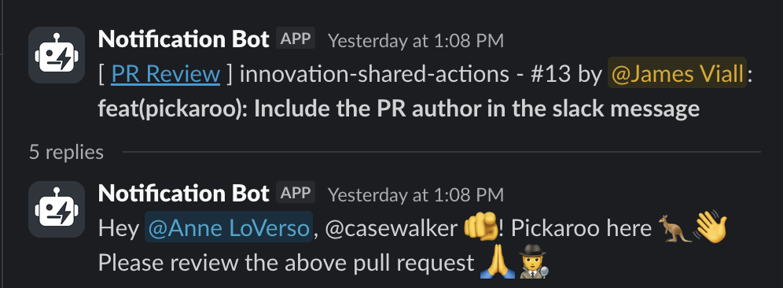

We have a collection of GitHub Actions that can be used to implement common Workflows to improve the efficiency of your projects. Alongside these Actions are also pre-configured Workflows that implement the most common of these, for your convenience.

View the [innovation-shared-actions repository (internal)](https://github.com/newjersey/innovation-shared-actions).

## Pickaroo reviewers workflow

A common workflow at the office is to request a couple random reviews from engineers that are part of the broader initiative (i.e. ResX or BizX), but are external to the given project. This workflow automates that process and sends a Slack notification to a given channel, tagging the selected reviewers.

### How it works

The Pickaroo Reviewers workflow provides a complete solution for automated PR review assignment:

1. Randomly selects reviewers from specified [GitHub Teams](https://github.com/orgs/newjersey/teams) and/or individual users and assigns them to the PR.
2. Looks up Slack user IDs for the selected reviewers
3. Sends a formatted Slack message of the PR details, and mentions the reviewers in a threaded message.

The workflow only sends Slack notifications if reviewers were actually selected and assigned.

### Requirements

#### Install the OOI Pull Request GitHub App

- Install the [OOI Pull Request Github App](https://github.com/apps/ooi-pull-request-app) in your repository. This might require creating a [Tech-Ops ticket](https://github.com/newjersey/internal-ops/issues/new/choose)!

#### Repo must be in the same organization

This workflow consumes organization-level secrets. GitHub only allows access to shared workflow secrets if the calling repository is in the same GitHub org.

#### Add the Slack notification bot to your Slack channel

Slack will block messages unless the bot is a member of the channel.

To add the bot:

1. Open the Slack channel
2. Add "Notification Bot" to the channel
3. Ensure the bot appears in the channel's integrations list

#### Required secrets

The workflow expects these secrets (already configured at the organization level):

- `OOI_PULL_REQUEST_APP` - Private key for the GitHub App
- `SLACK_OAUTH_TOKEN` - Slack OAuth token for sending messages

### Inputs

| Name                  | Required | Type   | Description                                                                                                                            |
| --------------------- | -------- | ------ | -------------------------------------------------------------------------------------------------------------------------------------- |
| `include_teams`       | No       | string | The github teams to pick reviewers from (space delimited). Must be a [New Jersey GitHub Team](https://github.com/orgs/newjersey/teams) |
| `exclude_teams`       | No       | string | The github teams to exclude reviewers from (space delimited)                                                                           |
| `include_users`       | No       | string | Individual GitHub usernames to include (space delimited)                                                                               |
| `exclude_users`       | No       | string | Individual GitHub usernames to exclude (space delimited)                                                                               |
| `number_of_reviewers` | No       | number | The number of reviewers to select, defaults to 1                                                                                       |
| `channel_id`          | Yes      | string | The Slack Channel ID to notify                                                                                                         |

### Using this workflow in your repository

Create a new workflow file, e.g. `.github/workflows/request-reviewers.yml`. You likely don't want to auto-request reviewers for _every_ pull request, and especially not every update, so you'll want to create a workflow separate from your primary 'CI' workflow, and trigger it based on labels:

```yaml
name: Pickaroo Reviewers

on:
  pull_request:
    types: ["labeled"]

jobs:
  request-review:
    if: contains(github.event.pull_request.labels.*.name, 'request-review')
    uses: newjersey/innovation-shared-actions/.github/workflows/pickaroo.yml@main
    with:
      include_teams: "innovation-engineering"
      exclude_teams: "my-project-team some-other-team" # multiple teams are space-delimited
      include_users: "specific-user another-user"
      number_of_reviewers: 2
      channel_id: "C09Q34G9HMX"
    secrets: inherit
```

With this configuration, new PRs will only auto-assign and notify random reviewers when you add the label `request-review`. The notifications will look something like this:



:::tip
In order to directly mention Slack users based on their GitHub usernames, Office members need to update their Slack profile to populate the `GitHub Username` field, else we'll fallback to just the plain-text GitHub username in the notification, as you can see above with `@casewalker`.
:::

## Building your own Workflow from the Action

For more complex workflows or custom integrations, you can use the underlying Github Action directly. This gives you finer control over the reviewer selection process without the automatic Slack notifications. You may desire to do this if you want to have multiple rounds of reviewer selection before sending a slack notification, or if you want to customize the slack message, or perhaps a third, mysterious thing.

### How it works

The Pickaroo Action handles the core reviewer selection logic:

1. It creates a combined list of potential reviewers that are members of the included teams / users, and omits those that are part of the excluded teams/members, authored the PR, or have already had a review requested.
2. Randomly selects the specified number of reviewers
3. Adds them as requested reviewers to the pull request
4. Outputs the selected reviewers for use in subsequent workflow steps

### Requirements

#### GitHub Token with proper permissions

You'll need a GitHub token with:

- `org:teams:read` permissions (to read team memberships)
- `repo:pull_requests:write` permissions (to assign reviewers)

This is typically provided by the OOI Pull Request GitHub App which, just as with the above workflow, you'll need installed in your repository.

### Inputs

| Name                  | Required | Type   | Description                                                               |
| --------------------- | -------- | ------ | ------------------------------------------------------------------------- |
| `include_teams`       | No       | string | The github teams to pick reviewers from (space delimited)                 |
| `exclude_teams`       | No       | string | The github teams to exclude reviewers from (space delimited)              |
| `include_users`       | No       | string | Individual GitHub usernames to include (space delimited)                  |
| `exclude_users`       | No       | string | Individual GitHub usernames to exclude (space delimited)                  |
| `number_of_reviewers` | No       | string | The number of reviewers to select, defaults to "1"                        |
| `token`               | Yes      | string | Github token with org:teams:read and repo:pull_requests:write permissions |

### Outputs

| Name        | Description                                           |
| ----------- | ----------------------------------------------------- |
| `reviewers` | Space-delimited string of selected reviewer usernames |

### Using this action in your repository

```yaml
name: Custom Reviewer Assignment

on:
  pull_request:
    types: ["labeled"]

jobs:
  assign-reviewers:
    runs-on: ubuntu-latest
    permissions:
      contents: read
    if: contains(github.event.pull_request.labels.*.name, 'request-review')
    outputs:
      reviewers: ${{ steps.external-reviewers.outputs.reviewers }} ${{ steps.internal-reviewers.outputs.reviewers }}

    steps:
      - uses: actions/checkout@v6

      - name: Generate GitHub App Token
        id: generate_token
        uses: actions/create-github-app-token@29824e69f54612133e76f7eaac726eef6c875baf # v2.2.1
        with:
          app-id: "2454947"
          private-key: ${{ secrets.OOI_PULL_REQUEST_APP }}

      - name: Select Internal Reviewers
        id: internal-reviewers
        uses: newjersey/innovation-shared-actions/.github/actions/pickaroo@main
        with:
          include_teams: "my-project-team"
          number_of_reviewers: 1
          token: ${{ steps.generate_token.outputs.token }}

      - name: Select External Reviewers
        id: external-reviewers
        uses: newjersey/innovation-shared-actions/.github/actions/pickaroo@main
        with:
          include_teams: "innovation-engineering"
          exclude_teams: "my-project-team"
          number_of_reviewers: 2
          token: ${{ steps.generate_token.outputs.token }}

  notify-slack:
    needs: assign-reviewers
    if: needs.assign-reviewers.outputs.reviewers != ''
    uses: newjersey/innovation-shared-actions/.github/workflows/slack.yml@main
    with:
      channel_id: "C09Q34G9HMX"
      message: "[ <${{ github.event.pull_request.html_url }}|PR Review> ] ${{ github.event.repository.name }} - #${{ github.event.pull_request.number }}: ${{ github.event.pull_request.title }}"
      thread_message: "Hey ${{ needs.assign-reviewers.outputs.reviewers }}! Please review the above pull request 🙏"
    secrets: inherit
```

### References

- [Pickaroo Workflow](https://github.com/newjersey/innovation-shared-actions/blob/main/.github/workflows/pickaroo.yml)
- [Pickaroo Action](https://github.com/newjersey/innovation-shared-actions/blob/main/.github/actions/pickaroo/action.yml)
- [OOI Pull Request GitHub App](https://github.com/apps/ooi-pull-request-app)
