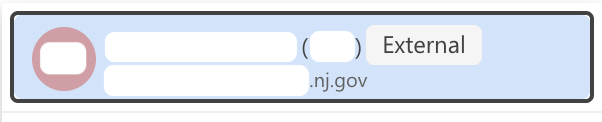
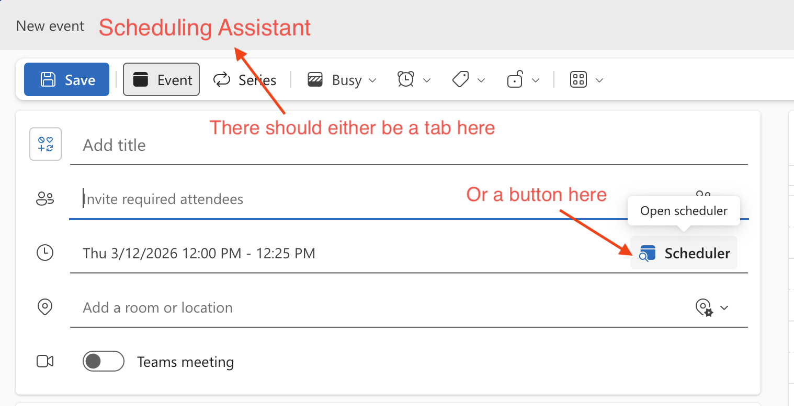
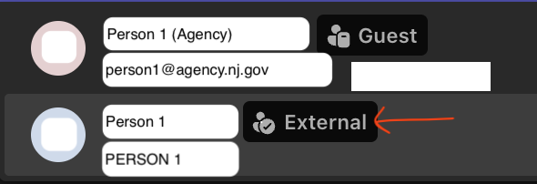

There can be technical and tooling barriers when collaborating with other agencies. For instance, agencies might be on a different Microsoft tenant. Here are some solutions we found for working around these.

**In this guide, an external user refers to a user in an agency that is on a different Microsoft tenant. Not all agencies are on a different Microsoft tenant.** To determine if an agency partner is on a different Microsoft tenant, try adding someone from the agency in the `To:` line of an Outlook email, and check if "External" appears next to the contact. If so, they are an external user on a different Microsoft tenant.

## Outlook calendar availability

You may not be able to add the calendars of external users. However, you should be able to view their calendar availability via the "Scheduler" / "Scheduling Assistant" view.

1. Create a new meeting, and add your desired attendees
2. In the expanded meeting dialog, there should either be
   - A button next to the time input that says "Schedule"
   - Or, a tab near the top left that says "Scheduling Assistant"
     
3. Click on "Schedule" / "Scheduling Assistant". The view should show availability the people invited to the meeting.

## Microsoft Teams group chat

Live chat communication can be a lot smoother than emailing back and forth. Agency partners do not have Slack access, and use Microsoft Teams instead.

Creating a Teams meeting creates a chat, but these chats can get clogged with meeting chatter. Additionally, access to the chat can get messed up when attendees decline the meeting invite. Instead, we recommend creating group chat(s) with agency partners, as follows:

1. Follow these [instructions to create a group chat](https://support.microsoft.com/en-us/office/create-a-group-chat-in-microsoft-teams-free-556d9323-75f4-4cbe-ba49-e65d7d8d53a8#id0ejd=desktop)
   - If the agency is on the same Microsoft tenant, only one `Guest` contact will appear
   - If the agency is external, make sure to add the contact tagged as `External`, and _not_ the one tagged as `Guest`
     
2. Follow the [same instructions page](https://support.microsoft.com/en-us/office/create-a-group-chat-in-microsoft-teams-free-556d9323-75f4-4cbe-ba49-e65d7d8d53a8#id0ejd=desktop) to name the group
3. You can [create a section in Teams](https://support.microsoft.com/en-us/office/reorder-the-chat-and-channels-list-in-microsoft-teams-964d8358-53c3-4200-8cb1-5e9c5091031e) to organize these chats above any meeting chats

Make sure to configure notifications as desired for messages on Teams.

## Sharing documents

Agency partners do not have Google accounts, and do not have access to Google Drive or Google Workspace. Options for sharing files with agency partners include sharing via Sharepoint or OneDrive. Neither are great, especially when it comes to sharing with external users.

Pros of Sharepoint/Cons of OneDrive:

1. Organizational ownership
   - A OneDrive folder that is shared is still primarly owned by a single person. Whereas a Sharepoint is collectively owned by the owning organization.
1. Organization-wide link access
   - Sharepoint allows creating links that can be accessed by anyone in the organization that owns the Sharepoint. E.g., if the Sharepoint is owned by NJIA, it is possible share a link to the Sharepoint home, or to a given folder or file, that is accessible by everyone in NJIA even if you didn't specifically grant them access. Unclear of this is possible in OneDrive.

Pros of OneDrive/Cons of Sharepoint:

1. Potential Sharepoint restrictions on moving files
   - The Sharepoint for the Doula Medicaid project does not have the option to move a file between folders. The menu option is simply not there. The project has had to download and re-upload files to move them between folders.
   - Not sure of this is specific to the Doula Medicaid Sharepoint. [Microsoft docs](https://support.microsoft.com/en-us/office/move-or-copy-files-in-sharepoint-00e2f483-4df3-46be-a861-1f5f0c1a87bc) suggest that moving should be possible.
1. Direct links to Sharepoint files cannot be accessed by users who are external to the Microsoft tenant that owns the Sharepoint
   - This is the case even if the external user has sitewide, "Site owners - full control" access to the Sharepoint
   - This means that if the Sharepoint is owned by NJIA, and an agency partner is external, you need to remember not to send or hyperlink direct links to files.
     - If you do so, they will not be able to access the files.
     - You have to instead share the link to the Sharepoint homepage, convey where in the directory structure the file is, and have agency partners click through the folders.
   - Unclear if this is the case with OneDrive, though we suspect not due to the next point
1. Clearer and more granular access control on OneDrive
   - There have been mentions that OneDrive allows more granular access control for sub-folders, in a way that is easier to understand than Sharepoint
1. Cumbersome to sync a local copy of Sharepoint files
   - If stakeholders will be making a lot of edits, they may be more familiar and comfortable with having and editing a local copy of e.g. a Microsoft Word doc. Or, you might have [frustrations with using Microsoft Online](#microsoft-online-bugs-and-friction) and prefer using Microsoft's desktop appliations.
   - It is easy to set up this local syncing in OneDrive; you and agency partners probably already have this set up.
   - Sharepoint has [two options for syncing files](https://support.microsoft.com/en-us/office/sync-sharepoint-files-and-folders-87a96948-4dd7-43e4-aca1-53f3e18bea9b). However
     - The recommended option is to use OneDrive shortcuts. However, these seem to only work at least one folder level down from the Sharepoint root. It does not seem possible to create a OneDrive shortcut for the root/home of the entire Sharepoint
     - The [other option, syncing](https://support.microsoft.com/en-us/office/sync-sharepoint-and-teams-files-with-your-computer-6de9ede8-5b6e-4503-80b2-6190f3354a88), might be worth considering
     - Both options require cumbersome set up that might be difficult to direct less tech-savy agency partners to configure

If you would like to set up a Sharepoint, consider whether you want NJIA or the agency partner to own the Sharepoint, given the tradeoffs above. If you want NJIA to be the owning organization, create a Tech Ops ticket to request a Sharepoint.

## NJIA Powerpoint slides template

NJIA has a [presentation deck template on Google Slides](https://docs.google.com/presentation/d/12qxkMu3teEmbc6suXCDf_jc_Yc_8lNnCSLcmwi8w9fo/edit?slide=id.g2ccee5e38cb_0_46#slide=id.g2ccee5e38cb_0_46). Microsoft Powerpoint does not have templates, but one can export the Google Slide as `.pptx`, and import them into Powerpoint.

## Github

### Joint access to a repository

Agencies may have their own GitHub instance. Some may use GitHub Enterprise accounts that are accessed via Microsoft SSO and partitioned from the public GitHub space. For instance, may not be possible to add your public-GitHub Innovation account to an agency repository, or to add an agency GitHub Enterprise user to a repository in https://github.com/newjersey.

However, an agency with GitHub Enterprise SSO accounts should be able to add your @oit.nj.gov accounts as guest users to their GitHub instance. If the agency is unable to add your OIT accounts, you may have to get an agency email accounts.

We suggest:

1. Start a conversation to learn whether the agency has their own GitHub instance, and if so who would have admin access, and how accounts are provisioned (e.g. Enterprise SSO)
1. If the agency has GitHub Enterprise, they could [create an organization within the enterprise](https://docs.github.com/en/enterprise-cloud@latest/admin/managing-accounts-and-repositories/managing-organizations-in-your-enterprise/adding-organizations-to-your-enterprise) to isolate collaboration with NJIA from other projects.
1. Request access for people on the project, by requesting to add your @oit.nj.gov accounts as [guest users within the organization](https://docs.github.com/en/enterprise-cloud@latest/admin/managing-accounts-and-repositories/managing-users-in-your-enterprise/enabling-guest-collaborators).
   - Note that for some people who joined NJIA earlier, their @oit.nj.gov email may be different from their @innovation.nj.gov email.
   - We also suggest requesting repository read access for NJIA engineers who would do PR reviews.

### When should the repository be in the agency GitHub

If the agency has a GitHub instance, in the long term the repository should definitely live in the agency instance so that the agency has ownership over the project.

In the short term, there are some benefits to having a repository under https://github.com/newjersey :

1. Integrating with our Slack, so that you and reviewers can get live slack notifications on pull request conversations
1. Being able to [request reviews via Pickaroo](https://newjersey.github.io/innovation-engineering/guides/action-pickaroo/)
1. Making your project code discoverable for people at NJIA, and making your code available when engineers search within the `https://github.com/newjersey` project
1. If agency-owned AWS accounts for the project have not yet been provisioned, or you would prefer to try thing out in NJIA's AWS account, it might make more sense if the repo is also owned by NJIA.
1. We have an engineering principle of being [open/public by default and closed/private when necessary](https://docs.google.com/document/d/1G3Vx0J5zwTqrKF7iyej_KtBHF__rf7wrL_5RZ6rnJgw/edit?tab=t.0#heading=h.b0umhm4n3ckq), in the interest of transparency and knowledge sharing. We thus prefer keeping repositories open source. However, some agencies may have a blanket policy to not enable public repositories.
1. GitHub configurations that require organizational admins (e.g. adding apps like renovatebot, AWS integration) will have to go through the agency's GitHub admin(s), instead of NJIA Tech Ops. Depending on the permissions granted for the repository, configurations that require repository admin (e.g. setting up branch protection) may also have to go throuh the agency's GitHub admins.

However, migrating a repository later in a project can come with some downsides:

1. Needing to do the migration at all
2. Need to re-premission and reconfigure applications, e.g. renovatebot, AWS integrations
3. Most engineers don't have admin access to repositories in https://github.com/newjersey. However, you might be granted admin access to your repository in the agency account. So you might actually have more control and permissions on the agency repository, e.g. to add branch protections, change settings, or adjust access levels, without having to go through NJIA Tech Ops.

### Migrating a GitHub repo to a different organization

1. Figure out who in the agency has GitHub admin access
1. Create a Tech Ops ticket asking to migrate the repository. Include what repositories you want migrated, the agency admin contact, and any additional options you would like from https://github.com/timrogers/gh-migrate-project (such as configuring `assignee-mapping.csv`)
   - Tech Ops will likely use https://github.com/timrogers/gh-migrate-project to migrate the repository
   - We have also migrated projects using https://github.com/newjersey/dol-gh-enterprise-migration-scripts
1. Request to add any GitHub applications, and reconfigure them
   - e.g., renovatebot
   - If you use GitHub projects as an issue tracker, you may want to [enable built-in workflows](https://docs.github.com/en/issues/planning-and-tracking-with-projects/automating-your-project/using-the-built-in-automations) to e.g. automatically close issues when the status is set to `Done`

### Setting up ssh keys for two GitHub organizations

See [working in multiple Github Orgs](https://newjersey.github.io/innovation-engineering/guides/development/working-in-multiple-github-orgs/).

## Development set up and installation on agency machines

Folks at NJIA may have a laptop provisioned and managed by NJIA, and/or a state laptop provisioned and managed by OIT. Agency partners may have laptops/desktops provisioned by the agency, that are configured differently from the state laptops that OIT manages.

Agency partners may have restrictions on their machines, such as:

- Not having admin access
- Not being able to install applications
- Not being able to install extensions

Software such as VSCode, git, nvm, Cypress, or the WAVE extension may need to be provisioned by the agency's IT admins.

For installing a Node.js application on an agency machine without admin access, see the [running a Node project on native Windows](https://newjersey.github.io/innovation-engineering/guides/development/node-on-native-windows/) guide.

## Other limitations that have yet to be solved

See [this thread for additional conversation and considerations](https://njcio.slack.com/archives/C081SRUNN2U/p1765564663581579).

### Teams calls do not allow screen annotations while controlling the shared screen

Microsoft teams has a tool to enable people to draw and annotate on a shared screen.

### We have not figured out how to @-mention external users on shared Microsoft Online documents

There have been reports of not being able to @-mention external users, or potentially not being able to @- mention anyone in some circumstances on shared spaces (unclear).

One option is to get an agency email account. However, a separate account means a separate calendar that is not synced with your NJIA calendar.

### Microsoft Online bugs and friction

Microsoft Office is not as online-native as Google Workspace. Editing files in the browser using Microsoft Online tools can have weird bugs, from visual bugs to losing recent changes. One alternative is to sync a local copy (e.g. via OneDrive), and edit the file locally using desktop Microsoft applications.

Additionally, if any files go through heavy collaborative editing, the subpar behavior of Microsoft Online editors and presence of local files copies can cause Microsoft to create a second, parallel version of the file that then requires reconciliation. This is less likely to be a problem for engineers, then for large, text-heavy product documents.
