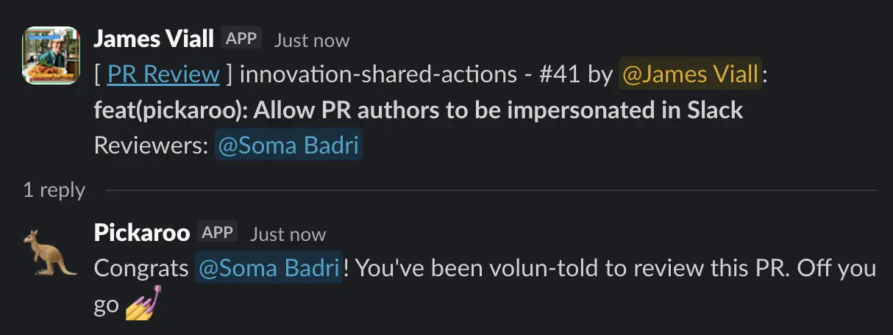

We have a collection of reusable GitHub Actions workflows to improve the efficiency of your projects. View the [innovation-shared-actions repository (internal)](https://github.com/newjersey/innovation-shared-actions).

## Pickaroo reviewers workflow

A common workflow at NJIA is to request a couple random reviews from engineers that are part of the broader initiative (i.e. ResX or BizX), but are external to the given project. This workflow automates that process and sends a Slack notification to a given channel, tagging the selected reviewers.

### How it works

The Pickaroo Reviewers workflow provides a complete solution for automated PR review assignment:

1. Randomly selects reviewers from specified GitHub teams and/or individual users and assigns them to the PR. It also:
   - filters out any potential reviewers whose slack status shows as Sick, OOO, or on leave.
   - on subsequent runs, will fill any gaps if reviewers were removed from the PR, or add one extra reviewer if there's already enough requested.
2. Maps the selected reviewers to their Slack user id's so they can be tagged in a Slack message.
3. Sends a formatted Slack message of the PR details, and mentions the selected reviewers in a threaded message.
4. Conveniently removes any labels that were added to the PR in in order to trigger the workflow run
5. Supports a `show` parameter (see our guidance on [Ship/Show/Ask](/innovation-engineering/reference/code-review)) to simply notify the given channel and skip selecting reviewers.
6. Supports impersonating the PR author for a more personalized Slack notification.

The results look something like this:


### Requirements

#### Install the NJIA Pull Request GitHub App

- Install the [NJIA Pull Request Github App](https://github.com/apps/ooi-pull-request-app) in your repository. This might require creating a [Tech-Ops ticket](https://github.com/newjersey/internal-ops/issues/new/choose)!

#### Repo must be in the same organization

This workflow consumes organization-level secrets. GitHub only allows access to shared workflow secrets if the calling repository is in the same GitHub org.

#### Add the Slack notification bot to your Slack channel

Slack will block messages unless the bot is a member of the channel.

To add the bot:

1. Open the Slack channel
2. Add "Notification Bot" to the channel
3. Ensure the bot appears in the channel's integrations list

#### Adding your GitHub username to your Slack profile

In order to mention the author and any assigned reviewers in a Slack message, Pickaroo needs to be able to map a Slack user to a GitHub user. This is achieved by everyone either:

- Populating the `GitHub Username` field of your Slack profile with your username
- Adding your GitHub username with a prefix to the `Name Pronunciation` field of your Slack Profile (this is a workaround for Multi-Channel guests) e.g.
  - `"JAYN DOH" gh: jane-doe`
  - `Github: superman99 "klahrk kent"`

#### Required secrets

The workflow expects these secrets (already configured at the organization level):

- `OOI_PULL_REQUEST_APP` - Private key for the GitHub App
- `SLACK_OAUTH_TOKEN` - Slack OAuth token for sending messages

:::note
When using the Pickaroo workflow in a workflow of your own, be sure to specify `secrets: inherit` for each job that uses Pickaroo. See the example below.
:::

### Inputs

| Name                  | Required | Type    | Description                                                                                                                                  |
| --------------------- | -------- | ------- | -------------------------------------------------------------------------------------------------------------------------------------------- |
| `include_teams`       | No       | string  | The github teams to pick reviewers from (space delimited) Must be a [New Jersey GitHub Team](https://github.com/orgs/newjersey/teams)        |
| `exclude_teams`       | No       | string  | The github teams to exclude reviewers from (space delimited)                                                                                 |
| `include_users`       | No       | string  | Individual GitHub usernames to include (space delimited)                                                                                     |
| `exclude_users`       | No       | string  | Individual GitHub usernames to exclude (space delimited)                                                                                     |
| `number_of_reviewers` | No       | number  | The number of reviewers to select, defaults to 1                                                                                             |
| `extras`              | No       | boolean | When `false`, Pickaroo will _not_ add an extra reviewer on subsequent runs if `number_of_reviewers` is already satisfied. Defaults to `true` |
| `number_of_repicks`   | No       | number  | **Deprecated.** Use `number_of_reviewers` instead.                                                                                           |
| `show`                | No       | boolean | If true, only post a Slack message without selecting reviewers                                                                               |
| `channel_id`          | Yes      | string  | The Slack Channel ID to notify                                                                                                               |
| `slack_as_author`     | No       | boolean | Allow the Slack App integration to impersonate the PR's author when sending a message to the above channel.                                  |

### Using this workflow in your repository

Create a new workflow file, e.g. `.github/workflows/request-reviewers.yml`. You likely don't want to auto-request reviewers for _every_ pull request, and especially not every update, so you'll want to create a workflow separate from your primary 'CI' workflow, and trigger it based on labels:

```yaml
name: Pickaroo Reviewers

on:
  pull_request:
    types: ["labeled"]

jobs:
  pr-review:
    if: contains(github.event.pull_request.labels.*.name, 'pr-review')
    uses: newjersey/innovation-shared-actions/.github/workflows/pickaroo.yml@main
    secrets: inherit # required because the underlying workflow accesses org secrets
    permissions: {} # we're not using the default GITHUB_TOKEN
    with:
      include_teams: "innovation-engineering"
      exclude_teams: "my-project-team some-other-team" # multiple items are space-delimited
      include_users: "specific-user another-user"
      exclude_users: "dhcole"
      number_of_reviewers: 2
      channel_id: "C09Q34G9HMX" #required
  pr-show:
    if: contains(github.event.pull_request.labels.*.name, 'pr-show')
    uses: newjersey/innovation-shared-actions/.github/workflows/pickaroo.yml@main
    secrets: inherit # required
    permissions: {}
    with:
      show: true
      channel_id: "C09Q34G9HMX" # required
```

In the above example, when a PR receives a `pr-review` label, it will use Pickaroo to select 2 random reviewers and notify the given Slack channel. When a PR receives a `pr-show` label, Pickaroo will just notify the Slack channel and skip selecting reviewers thanks to the `show` parameter.

:::note

The `slack_as_author` input is an _optional_ configuration. When set to true, the main slack message will appear to be sent by the PR's author. It will still have an indicator that discloses it as a Slack App, but nonetheless, make sure your project's participants are aware of this setting if you're going to use it.

If you'd like the option for individuals to choose, you can always create separate labels to run Pickaroo with this setting on/off.
:::

### Other Recipes

#### Multiple rounds of picking

A common workflow is selecting one random reviewer from a project's team and an additional reviewer from a broader cross-project group. You can achieve this by composing two separate Pickaroo jobs together. Use `needs` to sequence the jobs so they don't race, and set `extras: false` if you don't want an extra reviewer added on re-runs for either group (each run would get an extra).

```yaml
jobs:
  request-project-reviewers:
    if: ${{ github.event.label.name == 'pr-review' }}
    uses: newjersey/innovation-shared-actions/.github/workflows/pickaroo.yml@main
    secrets: inherit
    permissions: {}
    with:
      include_users: "timwright12 jviall aloverso"
      number_of_reviewers: 1
      extras: false # don't add extras for project reviewers
      channel_id: C03C7NHK9B4 # engineering-all

  request-initiative-reviewers:
    if: ${{ github.event.label.name == 'pr-review' }} # second job, same label
    needs: request-project-reviewers # avoid a race between jobs
    uses: newjersey/innovation-shared-actions/.github/workflows/pickaroo.yml@main
    secrets: inherit
    permissions: {}
    with:
      include_teams: "innovation-engineering"
      # exclude any users/teams that are included in the previous jobs,
      # so Pickaroo doesn't count them towards this job's number_of_reviewers.
      exclude_users: "dhcole timwright12 jviall aloverso"
      number_of_reviewers: 1
      channel_id: C03C7NHK9B4 # engineering-all
```

#### Always picking the same reviewers

Some times you don't want to randomly select reviewers be it from an internal or external team--you want the same reviewers every single time. Some teams achieve this by using [CODEOWNERS](https://docs.github.com/en/repositories/managing-your-repositorys-settings-and-features/customizing-your-repository/about-code-owners), but depending on what's ideal for your team you may prefer using Pickaroo to also benefit from the Slack notification. This can be done by simply specifying a `number_of_reviewers` that is equal to or greater than the number of people there is to pick from:

```yaml
jobs:
  request-project-reviewers:
    if: ${{ github.event.label.name == 'pr-review' }}
    uses: newjersey/innovation-shared-actions/.github/workflows/pickaroo.yml@main
    secrets: inherit
    permissions: {}
    with:
      include_users: "timwright12 jviall aloverso"
      number_of_reviewers: 3 # always assign these three users
      channel_id: C03C7NHK9B4
```

Or if you're using `include_teams`

```yaml
jobs:
  request-project-reviewers:
    if: ${{ github.event.label.name == 'pr-review' }}
    uses: newjersey/innovation-shared-actions/.github/workflows/pickaroo.yml@main
    secrets: inherit
    permissions: {}
    with:
      include_teams: "innovation-ccm"
      number_of_reviewers: 5 # there are 5 users on the innovation-ccm team
      channel_id: C03C7NHK9B4
```

#### Additional PR labels

You can always create as many additional jobs triggered on different PR labels to run Pickaroo with different parameters to suit all of your teams needs!

## References

- [Pickaroo workflow](https://github.com/newjersey/innovation-shared-actions/blob/main/.github/workflows/pickaroo.yml)
- [NJIA Pull Request GitHub App](https://github.com/apps/ooi-pull-request-app)
