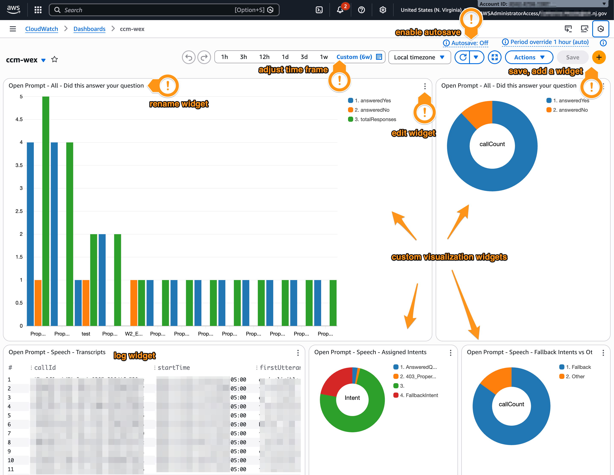

## What is a CloudWatch Dashboard?

CloudWatch is an AWS service that collects metrics, logs, and events from the AWS services we use. For example, a contact center team could use CloudWatch to monitor traffic, check response time, and log user input from Amazon Connect.

A "dashboard" is a customizable, single-page view of many saved metrics, logs, or widgets we find helpful to review on a regular basis. Dashboards can be useful for tracking current status, debugging features with historical data, or analyzing user patterns.

But Dashboards can also be a bit tricky to set up, and Amazon's documentation can be hefty. This guide intends to offer an easy entry into creating your first Dashboard, including best practices, simple instructions, and links to relevant documentation.

### When should I use a dashboard?

CloudWatch Dashboards are useful when you need to accomplish tasks such as:

- Monitor the health of your application
- Review metrics and logs across different services, e.g. [Connect](https://aws.amazon.com/connect/) and [Lex](https://aws.amazon.com/lex/)
- Save refined log queries to review on a regular basis
- Share common stats with team members
- Track incident response
- Demo the benefit of your application to stakeholders

### CloudWatch resources

- [📔 AWS Docs: What is CloudWatch?](https://docs.aws.amazon.com/AmazonCloudWatch/latest/monitoring/WhatIsCloudWatch.html)
- [📔 AWS Docs: Observability Guidance](https://aws-observability.github.io/observability-best-practices/tools/cloudwatch-dashboard/)

## Setting up your first Dashboard

### Before you start

Before creating a dashboard, you have to have the right permissions enabled. At minimum, your AWS user account must have:

- Access to the AWS Management Console
- IAM permissions
  - `cloudwatch:PutDashboard`
  - `cloudwatch:GetDashboard`
  - `cloudwatch:ListDashboards`

The average AWS user may not have access to enable these permissions on their own. To check which permissions you have enabled, log into the AWS console and search for IAM. Then go to **Policies** ➡ Login access role ➡ **Permissions** and review the permissions under "CloudWatch" there.

### Onward to CloudWatch

1. Sign in to the AWS Management Console
2. Navigate to **CloudWatch**
3. Select **Dashboards** from the left navigation (you may need to expand an accordion)

### Creating a custom dashboard

Now that we are inside the dashboards menu, we'll want to create our first custom dashboard. As a note, AWS changes often and so these instructions may be out of date. The AWS documentation on creating a custom dashboard is both more robust and more likely to stay current.

[📔 AWS Docs: Creating a custom dashboard](https://docs.aws.amazon.com/AmazonCloudWatch/latest/monitoring/create_dashboard.html)

#### 1. Make the dashboard

From **CloudWatch → Dashboards**, select **Create dashboard** on the top right.

Enter a name for your dashboard, paying attention to your organization's naming conventions.

#### 2. Add a widget

On the dashboard screen, in the top right corner, click the plus sign to add a widget.

Choose a widget type. For simplicity, let's start with a simple text log. Select **Logs** under "data type," then **Logs Table** under "widget type." Then select **Next** on the bottom right.

#### 3. Configure logs

At this point you should be on the Logs query screen. At the top of the console, you should see a dropdown menu labeled "selection criteria." Use this to select your log group. [More on finding your log group below.](#finding-your-log-group)

The default query is a good place to start, and should be auto-populated in the console:

  ```sql
    fields @timestamp, @message
      | sort @timestamp desc
      | limit 10000
  ```

After selecting your log group, you can run this code by using the **Run query** button below the console.

This tells CloudWatch to review the logs of your log group, create a field for "timestamp" and "message." "Message" is usually the full log payload, often in JSON. Then we "sort" by timestamp descending, and "limit" the responses to the first 10,000 logs. Logs can be quite custom, but AWS offers some documentation right from the AWS Console, which you should be able to review on the right-hand side of the AWS screen. For more information on logs, review:

- [📔 AWS Docs: CWL Query Syntax Examples](https://docs.aws.amazon.com/AmazonCloudWatch/latest/logs/CWL_QuerySyntax-examples.html)
- [📔 AWS Docs: Analyzing Log Data](https://docs.aws.amazon.com/AmazonCloudWatch/latest/logs/AnalyzingLogData.html)

Bookmark that for later, let's just try out the base query for now.

#### 4. Configure time range

Queries default to only the last one hour of data. To log a longer time frame, select the desired length from the horizontal menu above the code console.

[More on Time ranges below.](#time-ranges)

#### 5. Test and save the widget

Select **Run Query** from below the console.

If everything is configured correctly, you should now have a list of json data representing your application logs for the selected time frame.

If so, select **Save widget** and return to the dashboard.

If you see no logs, you may need to review these steps or the [Troubleshooting section](#troubleshooting) below.

#### 6. Save the dashboard

Once you are back on the Dashboard screen, you should see your new Logs Table widget. You can rename this widget, resize it, or move it around the screen as you'd like.

🎀 Be sure to save your new dashboard by selecting **Save** in the top right corner. If you have unsaved changes, this button will change to the primary button style (in most cases, a bright orange button).



## Fancy Stuff

Now that you've created a dashboard and a simple widget, you should be in a good place to start building a robust, application-specific dashboard. Here are features of dashboards to explore next.

### Text Widgets

Use **text widgets** to add sections, context, links, or notes.

### Graphs and Charts

One of the best things about CloudWatch dashboards is the ability to create custom charts and graphs of your data. Pie charts are useful for comparing data or viewing percentages, while line graphs and bar charts can show changes over time or across groups. Creating charts from log data requires a deeper understanding of CWL syntax, as you may wish to filter and group data in unique ways.

[📔 AWS Docs: Graphing Metrics](https://docs.aws.amazon.com/AmazonCloudWatch/latest/monitoring/graph_a_metric.html)

### Metric Math

Metric Math allows you to derive new metrics from existing ones, such as error percentages, aggregated throughput, ratios, comparisons, and other statistics. Depending on your application and AWS services, Metric Math will be more or less helpful. AWS provides several default options for each service type.

[📔 AWS Docs: Metric Math](https://docs.aws.amazon.com/AmazonCloudWatch/latest/monitoring/using-metric-math.html)

## Best practices

### Design dashboards around questions

Dashboards can be overwhelming quickly. Before getting too excited and adding a million widgets to your dashboard, talk with your team (or yourself) and determine the most important metrics to understand about your application. It can be a good idea to design dashboards around questions, rather than services. For example, you might ask, "What percentage of our users have their question(s) answered by our automated chat bot?" This dashboard could have widgets tracking the number of individuals calling the Tax question line, what questions they asked, how each question was assigned an answer, and how many callers said their reason for calling was resolved.

### Create different dashboards for different purposes

If you come up with several questions it may be a good idea to create multiple dashboards, especially if each question has different stakeholder audiences. For example, our user question above is important to business and product. We may also decide to create a second, engineer-focused dashboard that tracks [Lex](https://aws.amazon.com/lex/) response times and how many errors the system flagged.

### Less is more

Refining our dashboards in this way helps keep metrics focused and readable. Often, using a few targeted widgets with clear metrics can be more useful than attempting to track every variation of your application.

### Try out automated dashboards

If you aren't sure where to start, AWS provides a number of automatic dashboards for their services. An automatic dashboard requires no setup and often provides a baseline perspective into application health.

Review these to identify metrics that may be useful to you and your team.

[📔 AWS Docs: Getting started with automated dashboards](https://docs.aws.amazon.com/AmazonCloudWatch/latest/monitoring/GettingStarted.html)

## Troubleshooting

### Time ranges

If no data is showing on your dashboard, the most likely reason is that there simply is no data for the selected time frame. AWS defaults to the last 3 hours. You may need to adjust the time frame to be much longer than that.

Shorter ranges are generally better for operational monitoring; longer ranges are useful for trends and demos.

[📔 AWS Docs: Changing dashboard time frame](https://docs.aws.amazon.com/AmazonCloudWatch/latest/monitoring/change_dashboard_time_format.html)

### Finding your log group

Log groups are not consistently named across AWS services. Most take the format of `/aws/service/uniqueID`. Sometimes that unique ID is the name you gave the instance, function, or flow, but often it can be just a string of random numbers and letters.

🤔 Tip: I have personally had great success in finding my log group ID by navigating to my specific service and looking at the URL.

[📔 AWS Docs: Working with Log Groups](https://docs.aws.amazon.com/AmazonCloudWatch/latest/logs/Working-with-log-groups-and-streams.html)

### Enabling logs

Some applications, such as AWS Connect, require logs to be enabled before they will be recorded to CloudWatch. This process varies from simple to complex and is different for every application. If you are unable to locate your log group in CloudWatch, or the log group has no content where you expect it, you may need to enable logging within the AWS service you wish to review.

Unfortunately, there are also different docs for how to enable logs in each service. Here are the Amazon Connect ones to help you find the kind of thing you're looking for.

[📔 AWS Docs: Contact flow logs](https://docs.aws.amazon.com/connect/latest/adminguide/about-contact-flow-logs.html)

### Always save

AWS defaults to "auto-save: off" when editing a dashboard. If you are working on your dashboard and log out without saving, you **will** lose your changes and AWS will not warn you. For this reason, it's a good idea to enable auto-save first thing _each time you log in_, or mash that save button like your dashboard is Microsoft Word and you are writing an essay the night before it's due.

### Amazon Q

When in doubt, Amazon Q is an automated assistant provided by AWS that can help quickly find answers right from the AWS Console.

I personally find Amazon Q most helpful when I ask it to link to documentation around my question. However, it can also help you problem solve bugs, walk you through finding buttons in the UI, and even refine your CWL log queries.

[📔 AWS Docs: Setting up Amazon Q](https://repost.aws/knowledge-center/setup-amazonq-developer-chat)
