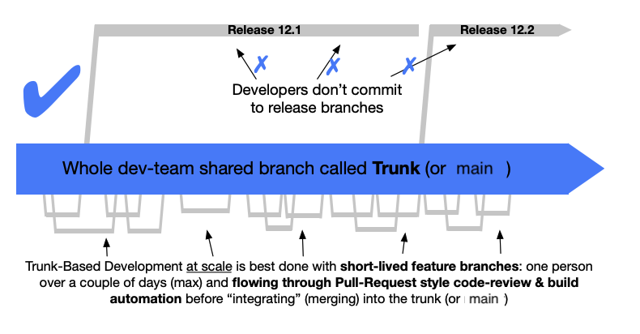

Practices are specific ways that we might enact our values and principles, day-to-day. They may shift and change as the needs of the team and the product demand. There are many different practices that may fulfill a given value or principle. It is always reasonable to suggest a practice may be changed to something else that still fulfills that principle. Being agile means constantly adjusting based on feedback: that includes practices. These particular practices have worked on some OOI teams in the past. That doesn’t mean they’re required. Do with them what you will.

Side note: this is why we often do not subscribe to dogmatic processes like Scrum. The leading philosophy behind Scrum is that teams should adopt a set of given practices, and if they follow them correctly, the team will unlock new capabilities. Instead, we believe in starting from values/principles and deriving practices that fulfill our principles - never starting from practices without a value/principle backing it. Certain scrum practices may in fact be beneficial to the team and fulfill our principles, but we do not subscribe to the idea that we should do a practice “because it is part of Scrum / part of ‘The Process’”. We should always be able to question, and to justify, the WHY behind any practice we commit to. And we should feel autonomy to change / adapt / discard it according to our needs and principles.

## Pair programming

Pair programming supports the principles of [shared context and shared responsibility](/innovation-engineering/onboarding/2-principles/#shared-context--shared-responsibility) because when two people work together on the same problem and piece of code, they automatically prevent silos. It also supports [continuous improvement](/innovation-engineering/onboarding/2-principles/#continuous-improvement--embracing-failure) because engineers working together will naturally learn from each other and grow as a result.

We have no particular rules about pair programming cadence - in conjunction with our principle of [developer trust & autonomy](https://newjersey.github.io/innovation-engineering/onboarding/2-principles/#developer-trust--autonomy), we trust developers to pair when it makes sense and solo when it makes sense. Join the `#engineering-pairing-is-caring` channel in Slack to join in for fortnightly (that’s every two weeks!) sessions to encourage pairing across projects.

Read our guide on [pairing techniques](/innovation-engineering/guides/pairing) for more tips.

## Test-Driven Development (TDD)

Unit testing is always something we do, non-negotiably. However, [test-driven development (TDD)](https://en.wikipedia.org/wiki/Test-driven_development) is one particular style of testing that has proven beneficial and embraces several of our stated principles. As a summary, it is the process of writing a failing test, adding the simplest possible code to get that test passing, and then refactoring as needed, then iterating (this cycle is termed [red-green-refactor](/innovation-engineering/reference/glossary)).

It supports [rapid feedback](https://newjersey.github.io/innovation-engineering/onboarding/2-principles/#rapid-feedback-in-all-contexts) - when each piece of code is written in service of getting a failing test passing, you get immediate feedback if the code works (because if it works, the test passes).

It supports [iteration and iterative development](https://newjersey.github.io/innovation-engineering/onboarding/2-principles/#iteration--incremental-change) by asking developers to code one test at a time, iterating from the simplest possible implementation to the one that solves the problem to the exact complexity required by the tests.

Some engineers here are fans of TDD; here's the justification of some of the benefits of TDD over traditional testing:

- **Break down problems**: by asking you to write one failing test that describes _one_ piece of the behavior you want to make happen, it forces you as the engineer to break down a large, complex feature into a single initial behavior described by a single test.
- **Fast feedback loops**: You get to immediately understand if something works, because you start with a failing test that describes the success condition. If it’s passing, then you know your code works (at least until you write another failing test)
- **Trust that the test is testing the thing**: Something we'll say all the time is _“never trust a test that you’ve never seen fail”_ because if you’ve never seen it fail, you can’t trust that it WILL fail if you accidentally break the functionality. TDD takes this worry away because you always start with a failing test. And when you write the code and it passes, you have confidence in a direct cause-and-effect relationship between the test passing and the new code that was added.
- **Ensure everything is tested**: Code coverage is a flawed metric. A better metric: “Are all my lines of code in service of getting a failing test passing?” This ensures that everything is tested without ever thinking about coverage percentage.
- **Confidence for refactoring**: A comprehensive test suite, whether it was test-driven or not, is valuable because it provides confidence that if you refactor and change the implementation, you haven’t broken anything. A codebase that can be changed and adjusted according to new requirements is necessary to keep going fast. And you can’t change and adjust your codebase without confidence that you’re not breaking anything. Tests give you that confidence. TDD gives you confidence that the tests cover every necessary behavior.

## Small, vertical-slice stories

This follows the principles of [iterative development](https://newjersey.github.io/innovation-engineering/onboarding/2-principles/#iteration--incremental-change) and [do what works / do the right thing](https://newjersey.github.io/innovation-engineering/onboarding/2-principles/#do-what-works--do-the-right-thing). When we define a feature and write code around a [vertical slice](https://en.wikipedia.org/wiki/Vertical_slice), it means that we focus on delivering one piece of end-to-end value for a user. We work iteratively, but we keep the idea of “user value” as the smallest unbreakable unit of work. If something is not valuable on its own, it is not a valid iteration. 

When we write a user story, we are attempting to define the smallest possible vertical slice of work that will provide value to the user. This follows our principle of [rapid feedback](https://newjersey.github.io/innovation-engineering/onboarding/2-principles/#rapid-feedback-in-all-contexts). Say that we want to build a text field where a user can input and save their name. If we build the frontend components that do nothing when the save button is pressed, then we don’t yet have feedback that the feature works. We can’t ship a button that does nothing to production. If we first build the backend database logic to handle saving, we don’t get feedback from it until it’s connected to the frontend that actually makes use of that endpoint. Only together, front-to-back, can this feature provide user value, and that’s what makes it a single vertical slice.

## Independently-deployable, green commits

A good practice is to have every commit to the main branch be an [iterative development](https://newjersey.github.io/innovation-engineering/onboarding/2-principles/#iteration--incremental-change) that maintains the cleanliness of the main branch. Every commit should add some small incremental value (even if it’s not a whole story). It should be independently deployable, so that it could theoretically be pushed to production without any further dependencies. And it should be “green” - ie, every commit should include a fully passing test suite. Partially-incomplete commits will make it hard to debug what introduced a problem when bugs do occur.

## Trunk-based development

[Trunk-based development](https://trunkbaseddevelopment.com/) is a practice for managing git workflows that embraces our principles of rapid feedback and shared responsibility.

Because developers are collectively maintaining a single source-of-truth for the codebase, they are collectively responsible for keeping the pipeline green and not merging broken code into the main branch. When the main branch is red, the engineers are collectively responsible for fixing it, because what’s broken for one is broken for all.

Short-lived branches and regular merges / rebases with the main branch give us constant feedback that tells us that not only does our code work in isolation on our local computer (or branch), it works in integration with the code from the rest of the team, and it works in a clean CI environment.

## Continuous Integration / Continuous Deployment (CI/CD)

The CI in CI/CD stands for continuous integration, which is synonymous with regular merges to a main branch. When we keep long-lived feature branches, we are no longer continuously (or frequently) integrating with the main trunk, and that fails to uphold this practice. Ideally, feature branches should achieve one single [independently deployable unit of work](/innovation-engineering/onboarding/3-practices/#independently-deployable-green-commits) and be quickly merged back to main within a day / couple days. Branches that are running for a week or longer should be assessed for why the anomaly is occuring. 

The CD in CI/CD stands for continuous deployment. In an conceptual ideal world, that means every commit to main gets deployed to production when it passes tests (this requires independently deployable commits as described above). In reality, most team use CD to continuously deploy to a dev environment, and then do manual QA checks before approval to go to prod. While this is common, it should go hand-in-hand with a team working agreement on a schedule for making prod deployments happen regularly (one or more times a week is a good target). Remember, if it’s not released to production, there is no way to get [rapid feedback](https://newjersey.github.io/innovation-engineering/onboarding/2-principles/#rapid-feedback-in-all-contexts) from users that the solution is solving their problems.

## Flaky tests and failing tests are worse than having no tests at all

If you have tests that are regularly flaking or failing on your main branch, you may as well delete them (!). 

_(NOTE: you shouldn't actually delete them, you should fix them. This statement is meant to be provocative rather than prescriptive.)_

Every test that fails should be a signal (a [rapid feedback](https://newjersey.github.io/innovation-engineering/onboarding/2-principles/#rapid-feedback-in-all-contexts)) that something has broken. When a test fails but nothing is wrong, it applies a numbing agent to your brain and dulls that signal. Before long, you have tests where “oh that one always fails, but nothing is actually wrong” and suddenly, you have lost the confidence that your test suite should provide. Your test suite becomes the boy who cried wolf. And then on the day when the wolf comes and the tests start failing for a real reason, you say “oh that one always fails, but nothing is actually wrong” and deploy broken code to production. In order for rapid feedback to be useful, it must be accurate.

The same principle applies with errors in your logs and web console. When there are always red warnings and errors popping up, you are more likely to miss a real error that could help alert you of a real problem.

## Refactoring & clean code

Refactoring is a necessary part of the software development process. When we work in a world of constantly changing requirements, we must always be able to adapt to new information. 

It is your responsibility as an engineer to prioritize refactoring as needed, which is a balance of [do the right thing / do what works](/innovation-engineering/onboarding/2-principles/#do-what-works--do-the-right-thing). When “doing what works” means to keep coding on top of a poorly-written mess of spaghetti code, it is most likely necessary to instead “do the right thing” and pause to refactor and improve the design of existing code, so that it is faster and easier to add new features in the future.

When determining what needs refactoring, it can be useful to be familiar with the [list of common code smells](https://refactoring.guru/refactoring/smells) and their associated [refactoring techniques](https://refactoring.guru/refactoring/techniques). We also have suggested reading of the book [_Refactoring_ by Martin Fowler and Kent Beck](https://martinfowler.com/books/refactoring.html).

Different types of refactoring:
- **Pre-factoring**: Anticipatory code restructuring for future changes to prevent technical debt.
- **In-the-moment refactor**: Spontaneous code improvement during feature development or bug fixing.
- **Immediate follow refactor**: Cleanup and refine code immediately after implementing changes.
- **Ticket refactor**: Scheduled refactoring tasks managed separately within the project workflow.

## Estimating in complexity, not time

Some teams don’t estimate work at all; that’s fine. When we do want to estimate work for one reason or another _(and we should always have a reason - [see the note at the start of this section](/innovation-engineering/onboarding/3-practices/) about practices always having a Why, and being derived from principles)_, we estimate in units of complexity, not time. It’s very hard to accurately say “this story will take a half-day to complete” - engineers are notoriously bad at estimating time. However, it’s much easier to say “this thing is twice as complex as that other thing”. 

Additionally, because we value [shared context / shared responsibility](/innovation-engineering/onboarding/2-principles/#shared-context--shared-responsibility), we avoid estimating in time because we want to devote energy to building a robust, un-siloed team. Time estimates for tickets are subjective - a story might take a half-day if Sal the Senior Engineer worked on it, but might take a full day if Jay the Junior Engineer worked on it. However, complexity is more objective regardless of who works on it.

Estimating in time incentivizes engineers to do stories that they are already good at doing because they can do them more quickly, which will hurt longer-term velocity by creating knowledge silos. In contrast, focusing on complexity incentivizes engineers to figure out how to reduce complexity by picking up tasks in new parts of the codebase and stack and by sharing context with each other, which builds resilience.

See our [reference doc on story estimation](https://newjersey.github.io/innovation-engineering/reference/estimation/) for more details.

