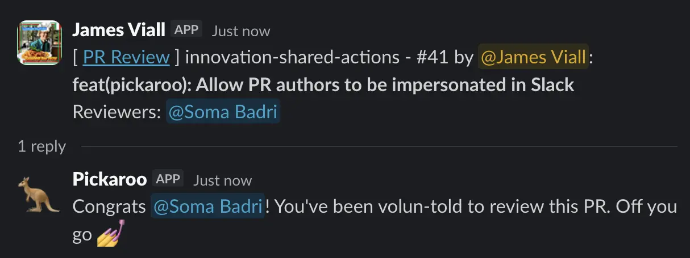
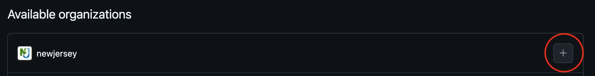
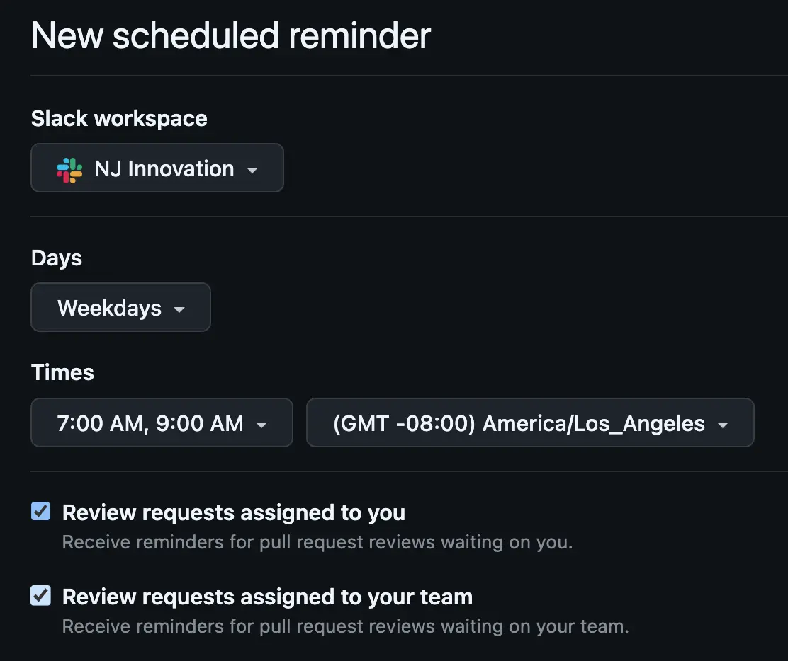
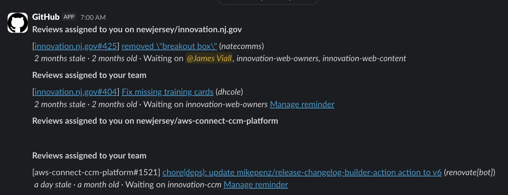
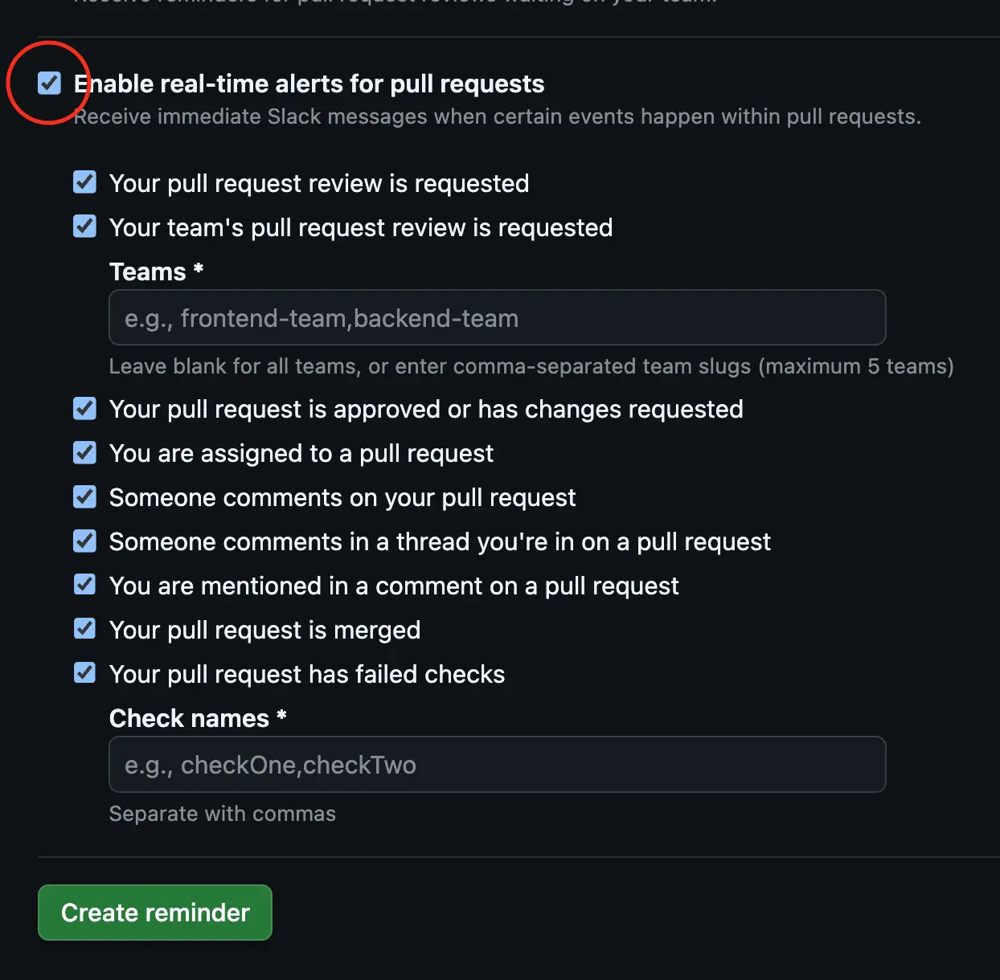

## 🥅 Goals

This document outlines our practices when reviewing code via pull requests. The goals of code review is to:

- Get the best code possible
- Improve the skills of developers so that they require less and less review over time
- Share domain knowledge across a distributed team

_Note: There are other useful ways of getting feedback on your work, such as design discussion, walking through code in a meeting, and pairing._

## 🙏 As the reviewee

### Principles

- Humility & open to feedback. Don’t take it personally - we are all working to make the best possible code as our primary goal.
- You are responsible for the changes you’re making. You should have confidence in the “what” and “why” behind a change. Don’t make a change simply because it was suggested; ensure you understand the “why” that the reviewer is presenting.
- Bring conversations to the larger team if more discussion is necessary.
- Use the [PR template](https://github.com/newjersey/innovation-repo-template/blob/main/.github/pull_request_template.md) to outline your approach. If there’s a specific line of code that’s an odd or unusual pattern, leave a GitHub comment on that line preemptively to shorten the feedback loop (so a reviewer doesn’t have to ask).

### When to request a review

We use the [Ship / Show / Ask](https://martinfowler.com/articles/ship-show-ask.html) framework:

- **Ship**: Make your change and push directly to `main`
- **Show**: Make your change on a branch, open a PR, then merge it without waiting for anyone. Post the already-merged PR for visibility.
- **Ask**: "Traditional" PR review where we wait for feedback before merging

It is the reviewee’s responsibility to decide if something needs review before getting merged. An “Ask” is not required to ship code. You should feel empowered to “Ship” or “Show” using your best judgment.

Some examples of code changes where you might not “Ask”

- Simple configuration change (feature flag, environment variables)
- Fast shipping is needed (time-sensitive bug fix)
- Documentation updates
- Follow-up changes based on a past review, already discussed
- You got feedback in other forms at an earlier stage (pairing, team discussion), and don’t feel you need further feedback

Some examples of projects where you might not “Ask” as often

- You want to quickly build out an MVP without being slowed down
- You are working on a repo that is not public-facing, doesn’t impact users
- You are working as a solo engineer on a project, so your code changes won’t directly affect other engineers

Generally, it works well to “Ask” by default if you’re not sure. On larger teams, we tend to “Ask” more often. This can help us share context, get sanity checks, and improve our skills. Simple changes may feel simple, but could elicit an unexpectedly large conversation.

If you have large/complex PR that you’d like to first share context about, feel free to set up time with your reviewers to go over the PR synchronously. This can help give necessary context and make this task less intimidating.

### Who should review your code

We expect each PR to have **2 reviewers total**. You can choose whether these are random or chosen for your team/subteam.

- **Chosen reviewer(s)**: do this if there’s someone specific to request a review from to give you the most confidence in your code. For example, someone on your subteam or someone who has specific context
- **Random reviewer(s)**: use the [Pickaroo GitHub Workflow](/innovation-engineering/guides/action-pickaroo) to randomly select reviewers from your project team and/or the broader initiative engineering team to build shared context, spread responsibility, and improve our reviewing skills if less experienced.

If you are the randomly assigned reviewer and don’t feel comfortable with this code, use this as an opportunity to learn from the chosen reviewer or the reviewee, by pairing or other methods. Either way, remember that your feedback will still be valuable regardless of whether you have the domain context.

If you feel that you need a further review after the 2, you could consider bringing in a 3rd person. But first reflect on what’s still missing and why, try to be specific, and also use this as an opportunity to understand if this is indicative of a larger issue/gap.

Only 1 approval is required to merge your code, but you must still address the comments of both reviewers either in the same PR or a follow-up

### How to request a review

1. If your project's repository hasn't already done so, configure a GitHub Action to run the [Pickaroo Workflow](/innovation-engineering/guides/action-pickaroo) configured to your team's preferences.

2. Trigger Pickaroo to run by adding the appropriate label to your PR, e.g. `pr-review`. It will randomly select the number of reviewers your workflow specifies from the given teams and/or users, assign them as reviewers to the PR, and notify them in the given Slack channel.

3. While Pickaroo intelligently avoids picking the author or people that are sick/out-of-office, sometimes the selected reviewer is otherwise unavailable. You can simply re-add the same label to your PR to run another round of selection.

4. Respond to Pickaroo's message if you need to provide any additional context to the selected reviewers, e.g. if you need reviews by a certain day or would prefer to do the reviews live over screen-share.

5. Each reviewer should react with eyes emoji 👀 to indicate they are looking at the PR. Reviewers should add a comment or the ✅ or `:approved-with-comments:` reaction to Slack when they have finished reviewing.

When you are doing a Show PR, follow only step 1 to post the PR link for visibility, using whatever label your workflow specified to trigger a "Show" run of Pickaroo (e.g. `pr-show`) without adding or tagging reviewers.

### Preparing work for review

Every PR should be a independently-deployable, green chunk of work.

If your next step of work depends on this commit, you can branch off the PR branch and work on the next piece while the code is in review.

Use our [PR template](https://github.com/newjersey/innovation-repo-template/blob/main/.github/pull_request_template.md) to outline your approach

If there’s a specific line of code that’s an odd or unusual pattern, leave a GitHub comment on that line preemptively to shorten the feedback loop (so a reviewer doesn’t have to ask)
For PRs that edit visual elements, provide before and after visuals (use your judgment to pick representative screenshots or videos)

#### Breaking down work into multiple commits

An independently-deployable PR can be made up of smaller, dependent commits. Making a commit for each new chunk of work is a good general working practice to take advantage of version control and help to structure your approach.

This can help the reviewer, who can choose whether to review commit-by-commit or review the diff in full.

It is the reviewee’s responsibility to squash all work into a single deployable commit (including review comment fixes) before merging main.

In the case of a large PR that is hard to break down, you should work to make it easier to review, e.g. setting up a synchronous meeting to go over code, breaking the PR into commits and asking for reviewers to review by each commit, or adding instructions on what to focus on in the PR description.

### Responding to a review

Do your best to acknowledge all comments in a review, whether you address them in this PR or not. Changing code to satisfy the comment will be dependent on the type of request.

If you agree to address something outside of the current PR, create an open ticket so that this work is tracked. Engineering team should be able to decide how to prioritize the ticket within the rest of the workstream.

## 🎁 As the reviewer

### Principles

- Trust and respect. Assume that the developer had a good reason for the code they wrote, and seek to understand that reason first (ask “why”) instead of assuming it is wrong or for no reason.
- Be kind. Mentoring and explaining “why” you’re suggesting something - not telling people “do x instead”.
- Suggesting examples is a good practice (“here’s some names that I think would be more descriptive”) whereas rewriting someone’s code for them is not desirable.
- You are responsible for reading the story and understanding the context of the code change
  Comments should indicate how serious / necessary the change is (see discussion below on scale)

### Use the rock scale

All review comments should be labeled with a rock to indicate whether they do or do not block the author from merging. This helps prioritize changes and streamlines the review process.

- **Boulder**: fix this before merging to main, requires re-review
- **Pebble**: fix this before merging to main, small thing needs no re-review
- **Sand**: fix this after merging in a follow-up refactor
- **Dust**: an idea / thought / musing, up to the reviewee to accept or discard

### Read and understand all the code

In the general case, look at every line of code that you have been assigned to review. Some things like data files, generated code, or large data structures you can scan over sometimes, but don’t scan over a human-written class, function, or block of code and assume that what’s inside of it is okay. Obviously some code deserves more careful scrutiny than other code — that’s a judgment call that you have to make — but you should at least be sure that you understand what all the code is doing.

Make a reasonable effort to understand the “why does this line of code exist” before leaving a comment to ask. This includes skimming related code and/or reading the tests in the diff. When you do leave a “why is this like this” question, and the reviewee responds, both parties should consider how the code could be refactored so that anyone else looking at it does not have the same question, typically in the form of descriptive variable naming, extracting a descriptively-named function, or writing a test describing the behavior. Explanations written only in GitHub are not helpful to future code readers.

### Giving guidance

Always explain WHY: give an explanation around your intent, the best practice you’re following, or how your suggestion improves code health.

In general it is the developer’s responsibility to fix the code, not the reviewer’s. You should not do detailed design of a solution or rewrite code for the reviewee. This doesn’t mean the reviewer should be unhelpful, though. You should strike an appropriate balance between pointing out problems and providing direct guidance.

- Pointing out problems and letting the developer make a decision often helps the developer learn, and makes it easier to do code reviews. It can also result in a better solution, because the developer is closer to the code than the reviewer is.
- However, it can be frustrating as a reviewee to attempt to fix a problem, only for it to come back up again in re-review if the solution is insufficient. As the reviewer, you should provide _enough_ clear guidance that the reviewee can feel comfortable implementing the change adequately.

#### Praise good things

If you see something nice in the code, tell the developer, especially when they addressed one of your comments in a great way. Code reviews often just focus on mistakes, but they should offer encouragement and appreciation for good practices, as well. It’s sometimes even more valuable, in terms of mentoring, to tell a developer what they did right than to tell them what they did wrong.

### When to review by

**In general, getting work across the finish line is more important than work-in-progress.** By this principle, we ask that reviewers prioritize completing reviews quickly.

If you are not in the middle of a focused task, you should do a code review shortly after it comes in.

If you are in the middle of a focused task, such as writing code, don’t interrupt yourself to do a code review. Instead, wait for a breakpoint in your work before you respond to a request for review. This could be when your current coding task is completed, after lunch, returning from a meeting, etc.

Our general expectation is: **1 business day for small-medium PRs, 2 business days for large PRs**

- We will use 24 hours from request as a general rule of thumb for a business day
- Reviewee should follow up and ping the reviewer (DM or thread) if the PR still has not been reviewed after this time
- Note that this timeline is the baseline, but can be adjusted collaboratively between the reviewer and reviewee as needed.

## 📥 Managing pull request notifications

Be you the author or a reviewer on a pull request, it's often difficult to keep track of what pull requests are assigned to you or when people leave a review on your PR. There are a couple patterns that many of us use at the office:

### GitHub's pull request page

A bookmark you might keep for daily review is the global Pull Request page in GitHub: https://github.com/pulls

It allows you to see all the various Pull Requests across every repository that you've created, been assigned to, etc. with search and filter capabilities.

### Pickaroo bot GitHub workflow

As mentioned above, many teams use the [Pickaroo Bot](/innovation-engineering/guides/action-pickaroo) to tag assigned reviewers in Slack messages:

You might take advantage of Slack's _Save for later_ or _Remind Me_ functionalities to manage multiple review requests over several days if you're not able to respond immediately.

### GitHub <> Slack app scheduled and real-time alerts

An extremely useful, often unknown feature of the [GitHub App in Slack](https://slack.github.com/) is something known as **Scheduled Alerts** and **Real-Time Notifications**. It provides terse notifications in Slack to remind you of the Pull Requests to review and any specific events (e.g. comments or assignments) that you'd prefer to receive push-notifications for. To configure this:

1. Install the [GitHub App in Slack](https://slack.github.com/)
2. Log in to GitHub via the Slack App
3. Navigate to the [Scheduled Reminders](https://github.com/settings/reminders) in your GitHub settings
4. Configure a new Scheduled Alert for the New Jersey organization:
   
5. This integration allows you to setup digest messages of the Pull Requests still pending your review on specific days and times:
   
   The digest messages will look something like this:
   
6. You can also configure **Real-Time Alerts** to receive push notifications in Slack on various Pull Request events:
   
   The real-time push-notifications will look something like this:
   
7. Be sure to finish by clicking the **Create reminder** button.
