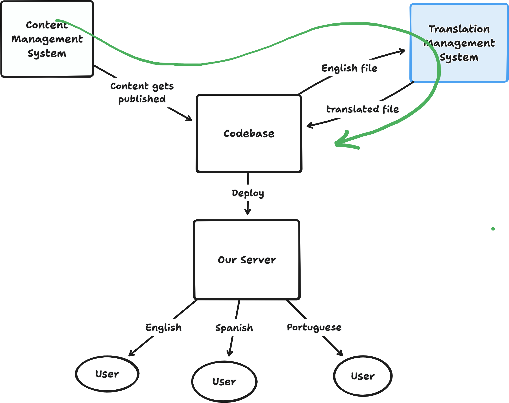

## i18n libraries

The best library to use for i18n depends heavily on the architecture and stack of your particular application. Smaller applications may have an easier time integrating i18n libraries, whereas more complex, content-heavy websites may need more custom work.

In past projects, we have used the following libraries:

### i18next

- In [**i18next**](https://www.i18next.com/overview/getting-started), content is stored in a JSON or Javascript Object, and for every locale we want to support, we keep one identically structured JSON/Object that stores the translated content.

- i18next keeps track of the current language of the app, and provides a translation function `t()` that references a piece of content by its key and returns the version of that content in the current language.

- We have often used the [**react-i18next**](https://i18next.com/) wrapper, which provides the translation function through a React Hook.

  ```
  const { t, i18n } = useTranslation();

  ```

- The `i18n` instance allows you to change the current language.
  ```
  i18n.changeLanguage('en-US');
  ```
- Examples:
  - We first used **react-i18next** to serve the [D4AD Training Explorer tool](https://medium.com/njinnovation/subpage/d4ad) in English and Spanish (unfortunately, not much of the original i18next implementation remains in the [archived repo](https://github.com/newjersey/dol-mcnj-main)).
  - We used **react-i18next** in [Unemployment Insurance Claim Status page](https://github.com/newjersey/dol-ui-claim-status-web-app/tree/dev/src/i18n) in 2023. This is a simple web app, all of the English content fits in one file.
    - _Of note:_ we had a lot of discussion on how much to test the app in each language, given how much of our existing tests relied on English content. We decided to [set up the unit tests](https://github.com/newjersey/dol-ui-claim-status-web-app/pull/128/changes#diff-84f6be72ed45f1bf4cdbd441d0bd824e38270a7599bd4eac2981b05eb7ad9d29R6) to only test against the English content, because we thought the inclusion of [an e2e test for switching between languages](https://github.com/newjersey/dol-ui-claim-status-web-app/pull/128/changes#r1489538566) was sufficient.
  - We have also used the [**astro-i18next**](https://astro-i18next.yassinedoghri.com/) wrapper in [Eviction Informational Intake pilot](https://github.com/newjersey/eviction-informational-intake).
    - _Of note:_ this implementation also includes translation of the URL slugs.
  - We may have used **i18next** (without wrappers) in the [Paid Leave application](https://github.com/newjersey/paid-leave-claim-status), but it's unclear how much content was actually translated.

### next-intl

- [**next-intl**](https://next-intl.dev/) was used for the [Municipality Lookup Tool](https://github.com/newjersey/business-address-lookup) on BizX.

---

## Translation Management Systems

We are in the process of procuring a Translation Management System (TMS) which will act as an interface for content leads and translators to translate and review multilingual content.

For applications that depend heavily on a Content Management System (CMS) (e.g. [BizX's MyAccount app](https://github.com/newjersey/navigator.business.nj.gov)), a integration between the CMS with the TMS will likely be necessary, to keep translations up to date with new and edited content.



_The green arrow represents the flow of content through our system. A good integration automates as of this flow as possible._

An overview of TMS options (as well as a proposed TMS integration plan for BizX's MyAccount app) can be found in [this decision doc](https://docs.google.com/document/d/1qz1JJdp2xJ1Hwn2u1VBNekKrRJ8vPDUTUZFKgn8dJWo/edit?tab=t.0).
